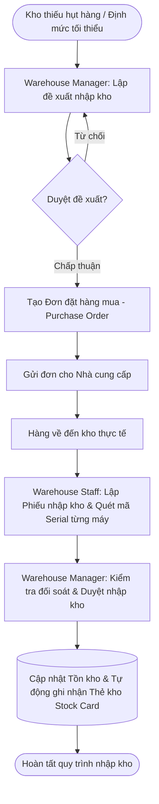
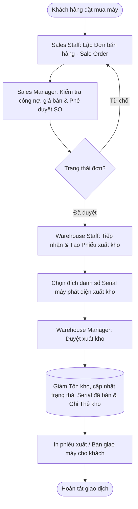
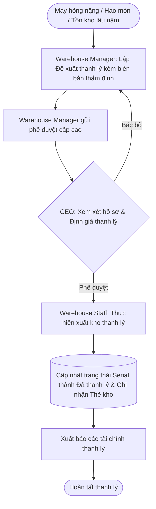

# Hệ Thống Quản Lý Kho Máy Phát Điện (GWMS)
### Generator Warehouse Management System — SWP391 (FPT University)


---

## 1. Giới thiệu tổng quan (Overview)

**Hệ thống Quản lý Kho Máy Phát Điện (GWMS)** là giải pháp phần mềm chuyên biệt phục vụ cho các doanh nghiệp phân phối, kinh doanh và lưu kho các dòng thiết bị máy phát điện công nghiệp và dân dụng. 

Khác với kho hàng tiêu dùng thông thường, quản lý kho máy phát điện đòi hỏi sự kiểm soát nghiêm ngặt về:
* **Định danh chi tiết theo từng máy (Serial Number Tracking):** Mỗi máy phát điện nhập kho đều được quản lý số Serial riêng biệt để theo dõi bảo hành, lịch sử xuất/nhập và vị trí kho.
* **Thông số kỹ thuật đa dạng:** Công suất (kVA/kW), loại động cơ, nhiên liệu (Diesel/Xăng), hãng sản xuất, số pha,...
* **Chu trình luân chuyển hàng hóa khép kín:** Từ khâu lập kế hoạch/đề xuất mua hàng $\rightarrow$ Đơn đặt hàng (PO) $\rightarrow$ Nhập kho $\rightarrow$ Lưu kho/Điều chuyển $\rightarrow$ Đơn bán hàng (SO) $\rightarrow$ Xuất kho $\rightarrow$ Kiểm kê & Thanh lý máy cũ/hỏng.
* **Phân quyền truy cập chặt chẽ (RBAC):** Đảm bảo an toàn dữ liệu, tính minh bạch trong các chứng từ phê duyệt và ghi nhận vết kiểm toán (Activity Audit Log).

---

## 2. Công nghệ sử dụng (Tech Stack)

### Backend
* **Ngôn ngữ:** Java 17 LTS
* **Nền tảng:** Jakarta EE 10 (Servlet API 6.0, JSP 3.1, JSTL 2.0)
* **Kiến trúc:** MVC (Model - View - Controller) kết hợp DAO (Data Access Object) Pattern
* **Bảo mật:** BCrypt (băm mật khẩu đa lớp), Filter-based Authentication & RBAC Authorization
* **Thư viện tích hợp:**
  * `jbcrypt` (0.4): Mã hóa và xác thực mật khẩu
  * `apache poi` & `poi-ooxml` (5.2.5) + `commons-io` (2.15.1): Xuất/nhập dữ liệu Excel (báo cáo, danh sách máy)
  * `jakarta.mail` (2.1.3): Gửi email thông báo, quên mật khẩu
  * `google gson` (2.10.1) & `json-simple` (1.1.1): Xử lý dữ liệu JSON API, Ajax
  * `httpclient` (4.5.13): Gửi HTTP requests tích hợp
  * `lombok` (1.18.28): Tối ưu hóa code Model/Entity

### Frontend
* **Giao diện:** HTML5, CSS3, JavaScript ES6
* **Framework:** Bootstrap 5, Font Awesome Icons
* **UI Components:** DataTables, Chart.js (thống kê Dashboard trực quan), SweetAlert2

### Cơ sở dữ liệu & Máy chủ
* **DBMS:** MySQL 8.0+ (InnoDB, UTF-8 Multilingual `utf8mb4`)
* **JDBC Driver:** MySQL Connector/J 8.0.33
* **Web Server:** Apache Tomcat 10.1.x *(Lưu ý: Bắt buộc dùng Tomcat 10.1+ do dự án sử dụng Jakarta EE 10 / servlet package `jakarta.*`)*
* **Build & Quản lý phụ thuộc:** Apache Maven

---

## 3. Kiến trúc hệ thống (System Architecture)

Hệ thống được xây dựng theo mô hình phân tầng tiêu chuẩn trong phát triển phần mềm doanh nghiệp:

```
                  ┌─────────────────────────────────────────┐
                  │          Trình duyệt người dùng         │
                  └────────────────────┬────────────────────┘
                                       │ HTTP / HTTPS
                                       ▼
                  ┌─────────────────────────────────────────┐
                  │             Security Filter             │
                  │  (Xác thực Session & Phân quyền URL)    │
                  └────────────────────┬────────────────────┘
                                       │
        ┌──────────────────────────────┼──────────────────────────────┐
        ▼                              ▼                              ▼
┌──────────────┐               ┌──────────────┐               ┌──────────────┐
│  Controller  │               │  Controller  │               │  Controller  │
│ (Order, PO)  │               │(Receipt, Gen)│               │ (User, Role) │
└───────┬──────┘               └───────┬──────┘               └───────┬──────┘
        │                              │                              │
        └──────────────────────────────┼──────────────────────────────┘
                                       ▼
                  ┌─────────────────────────────────────────┐
                  │      Data Access Layer (DAO / DAL)      │
                  │ (UserDAO, GeneratorDAO, StockCardDAO...)│
                  └────────────────────┬────────────────────┘
                                       │ JDBC
                                       ▼
                  ┌─────────────────────────────────────────┐
                  │        MySQL Database (warehousedb)      │
                  └─────────────────────────────────────────┘
```

Sơ đồ đóng gói Package chi tiết của dự án (Package Diagram):


---

## 4. Cấu trúc thư mục dự án (Project Structure)

```text
SWP391-QuanLyMayPhatDien-G1/
├── database/                             # Script khởi tạo và cập nhật cơ sở dữ liệu
│   ├── database now.sql                  # Bản dump Database MySQL chuẩn và mới nhất
│   ├── database.sql                      # Bản backup cơ sở dữ liệu ban đầu
│   ├── fix_stock_card_balances.sql       # Script kiểm tra và cân đối lại số dư thẻ kho
│   └── insert_sample_vouchers.sql        # Dữ liệu mẫu chứng từ
├── document/                             # Tài liệu phân tích thiết kế & sơ đồ hệ thống
│   ├── package diagram.png               # Sơ đồ phân rã package hệ thống
│   ├── package_diagram.drawio            # File nguồn Draw.io sơ đồ package
│   ├── Screen flow.drawio                # Sơ đồ luồng màn hình giao diện
│   ├── screen_flow_system.drawio         # Luồng hoạt động toàn hệ thống
│   ├── state diagram liquidation.drawio  # Sơ đồ trạng thái quy trình thanh lý
│   └── liquidation-swimlane.drawio       # Swimlane diagram quy trình thanh lý
├── src/
│   ├── main/
│   │   ├── java/com/quanlymayphatdien/g1/
│   │   │   ├── controller/               # Lớp tiếp nhận & điều hướng request
│   │   │   │   ├── admin/                # Dashboard, User, Role, Category
│   │   │   │   ├── authen/               # Login, Logout, Forgot Password
│   │   │   │   ├── generator/            # Quản lý danh mục & máy phát điện
│   │   │   │   ├── homepage/             # Điều hướng trang chủ
│   │   │   │   ├── inventory/            # Kiểm tra tồn kho, kiểm kê (Check)
│   │   │   │   ├── liquidation/          # Đề xuất & phê duyệt thanh lý
│   │   │   │   ├── order/                # Đơn đặt hàng bán (Sale Order)
│   │   │   │   ├── proposal/             # Đề xuất nhập kho & Purchase Order (PO)
│   │   │   │   ├── receipt/              # Phiếu nhập kho, phiếu xuất kho
│   │   │   │   ├── report/               # Báo cáo doanh thu, nhập xuất tồn
│   │   │   │   ├── transfer/             # Phiếu điều chuyển hàng giữa các kho
│   │   │   │   └── user/                 # Profile, thông báo cá nhân
│   │   │   ├── dal/                      # Data Access Layer (Kết nối DB & SQL)
│   │   │   │   ├── DBContext.java        # Cấu hình kết nối JDBC MySQL
│   │   │   │   ├── GeneratorDAO.java     # Thao tác dữ liệu máy phát điện
│   │   │   │   ├── StockCardDAO.java     # Ghi nhận và tính toán Thẻ kho
│   │   │   │   └── ...                   # Các DAO nghiệp vụ khác
│   │   │   ├── entity/                   # Các lớp ánh xạ dữ liệu (Models)
│   │   │   ├── filter/                   # Bộ lọc xác thực và kiểm soát quyền hạn
│   │   │   └── utils/                    # Thư viện tiện ích (BCrypt, Mail, Excel)
│   │   ├── resources/                    # Cấu hình hệ thống (persistence.xml,...)
│   │   └── webapp/                       # Tài nguyên web phía client
│   │       ├── assets/                   # CSS, JS, hình ảnh, icon, plugins
│   │       ├── view/                     # Các trang JSP theo từng phân hệ chức năng
│   │       └── WEB-INF/                  # web.xml, beans.xml
└── pom.xml                               # Quản lý dependencies Maven
```

---

## 5. Phân quyền và Chức năng hệ thống (RBAC)

Hệ thống được thiết kế theo cơ chế **Role-Based Access Control (RBAC)** với ma trận quyền hạn chi tiết:

| Phân hệ / Vai trò | Admin | Warehouse Manager (Quản lý kho) | Warehouse Staff (Nhân viên kho) | Sales Manager (TP Kinh doanh) | Sales Staff (NV Kinh doanh) | CEO (Giám đốc) |
| :--- | :---: | :---: | :---: | :---: | :---: | :---: |
| **Quản trị người dùng & Phân quyền** | Toàn quyền | Không | Không | Không | Không | Không |
| **Quản lý danh mục & Máy phát điện** | Có | Có | Xem | Xem | Xem | Xem |
| **Đề xuất mua sắm (Import Proposal)** | Có | Lập / Duyệt | Không | Không | Không | Xem |
| **Đơn đặt hàng mua (Purchase Order)** | Có | Lập / Quản lý| Không | Không | Không | Xem |
| **Phiếu nhập kho (Import Receipt)** | Có | Phê duyệt | Tạo / Quét Serial | Không | Không | Xem |
| **Đơn bán hàng (Sale Order)** | Có | Xem | Không | Phê duyệt | Tạo đơn | Xem |
| **Phiếu xuất kho (Export Receipt)** | Có | Phê duyệt | Xuất / Quét Serial | Không | Không | Xem |
| **Điều chuyển kho (Transfer)** | Có | Lập / Duyệt | Xuất / Nhập | Không | Không | Xem |
| **Kiểm kê kho (Inventory Check)** | Có | Duyệt cân đối| Lập phiếu đếm | Không | Không | Xem |
| **Thẻ kho (Stock Card)** | Có | Xem / Xuất file| Xem | Không | Không | Xem |
| **Thanh lý thiết bị (Liquidation)** | Có | Lập đề xuất | Không | Không | Không | Phê duyệt cấp cao |
| **Báo cáo & Thống kê chuyên sâu** | Có | Báo cáo Kho | Không | Báo cáo Doanh số| Không | Báo cáo Toàn diện |

---

## 6. Quy trình nghiệp vụ cốt lõi (Core Business Workflows)

### 6.1. Quy trình Mua sắm & Nhập kho Máy phát điện



### 6.2. Quy trình Bán hàng & Xuất kho Máy phát điện



### 6.3. Quy trình Đề xuất & Phê duyệt Thanh lý thiết bị



---

## 7. Tài khoản thử nghiệm hệ thống (Default Demo Accounts)

Sau khi nhập cơ sở dữ liệu từ file `database/database now.sql`, bạn có thể đăng nhập thử nghiệm với các tài khoản được cấu hình sẵn theo từng vai trò:

| Vai trò (Role) | Tên đăng nhập (Username) | Mật khẩu (Password) | Họ và tên hiển thị | Quyền hạn tiêu biểu |
| :--- | :--- | :--- | :--- | :--- |
| **System Admin** | `admin` | `admin123` | Quản trị hệ thống | Toàn quyền cấu hình, quản lý User, gán Role & Permission |
| **Warehouse Manager** | `warehousemanager1` | `123` | Phạm Minh Tuấn | Lập PO, duyệt phiếu nhập/xuất kho, duyệt kiểm kê |
| **Warehouse Staff** | `warehousestaff1` | `123` | Lê Văn Cường | Tạo phiếu nhập/xuất, quét số Serial máy, đếm kiểm kê |
| **Sales Manager** | `salemanager1` | `123` | Trần Thị Hương | Phê duyệt đơn đặt hàng bán (Sale Order), xem báo cáo doanh số |
| **Sales Staff** | `linh` / `thib` | `123` | Nguyễn Linh / Nguyễn Thị B | Tạo đơn bán hàng, tra cứu thông tin máy và tồn kho khả dụng |
| **CEO / Giám đốc** | `ceo` | `123` | CEO Executive | Phê duyệt thanh lý tài sản, xem báo cáo tổng hợp cấp cao |

> **Ghi chú về mật khẩu:** Hệ thống hỗ trợ cơ chế tự động nhận diện cả mật khẩu đã băm (BCrypt hash) và mật khẩu dạng text mẫu phục vụ quá trình bảo vệ đồ án/kiểm thử.

---

## 8. Hướng dẫn Cài đặt & Khởi chạy (Installation & Setup)

### 8.1. Yêu cầu môi trường (Prerequisites)
* **Java Development Kit (JDK):** Phiên bản **17** trở lên.
* **Cơ sở dữ liệu:** **MySQL Server 8.0** trở lên (khuyên dùng kết hợp MySQL Workbench hoặc DBeaver / Navicat).
* **Web Server:** **Apache Tomcat 10.1.x** (Bắt buộc phiên bản 10.1.x, **không** sử dụng Tomcat 9 hoặc cũ hơn).
* **Công cụ build:** **Apache Maven 3.8+** (thường đã tích hợp sẵn trong các IDE hiện đại).
* **IDE khuyên dùng:** NetBeans IDE 17+, IntelliJ IDEA Ultimate, hoặc Eclipse IDE for Enterprise Java.

---

### 8.2. Bước 1: Khởi tạo Cơ sở dữ liệu MySQL

1. Mở **MySQL Workbench** hoặc dòng lệnh MySQL:
```bash
mysql -u root -p
```
2. Thực thi script khởi tạo cơ sở dữ liệu mới nhất được đính kèm tại `database/database now.sql`:
```sql
SOURCE D:/SWP391-QuanLyMayPhatDien-G1/database/database now.sql;
```
*(Hoặc dùng tính năng **Data Import / Restore** trên MySQL Workbench trỏ tới file `database/database now.sql`).*

Script sẽ tự động:
* Tạo cơ sở dữ liệu `warehousedb` với bảng mã `utf8mb4`.
* Khởi tạo toàn bộ các bảng: máy phát điện, serial, kho hàng, người dùng, phân quyền, chứng từ xuất/nhập/chuyển kho/kiểm kê.
* Seed sẵn đầy đủ dữ liệu người dùng, danh mục máy phát điện và chứng từ mẫu để demo.

---

### 8.3. Bước 2: Cấu hình kết nối Cơ sở dữ liệu

Mở file mã nguồn:
`src/main/java/com/quanlymayphatdien/g1/dal/DBContext.java`

Kiểm tra và cập nhật thông tin tài khoản MySQL của máy bạn (nếu mật khẩu khác mặc định):
```java
public class DBContext {
    // ...
    public DBContext() {
        try {
            String username = "root";       // Thay đổi nếu username của bạn khác
            String password = "1234";       // Thay đổi thành password MySQL của bạn
            String url = "jdbc:mysql://localhost:3306/warehousedb?useUnicode=true&characterEncoding=UTF-8&autoReconnect=true&useSSL=false&allowPublicKeyRetrieval=true";
            Class.forName("com.mysql.cj.jdbc.Driver");
            connection = DriverManager.getConnection(url, username, password);
        } catch (ClassNotFoundException | SQLException ex) {
            Logger.getLogger(DBContext.class.getName()).log(Level.SEVERE, null, ex);
        }
    }
}
```

> **Mẹo:** Bạn có thể chạy trực tiếp phương thức `main()` trong file `DBContext.java` để kiểm tra kết nối tới MySQL trước khi khởi động ứng dụng web.

---

### 8.4. Bước 3: Build và Chạy ứng dụng trên IDE

#### Cách 1: Sử dụng Apache NetBeans (Khuyên dùng)
1. Mở NetBeans $\rightarrow$ **File** $\rightarrow$ **Open Project...** $\rightarrow$ Chọn thư mục `SWP391-QuanLyMayPhatDien-G1`.
2. Chuột phải vào Project $\rightarrow$ **Clean and Build** để Maven tự động tải dependencies.
3. Cấu hình máy chủ Tomcat:
   * Vào tab **Services** $\rightarrow$ **Servers** $\rightarrow$ Thêm máy chủ **Apache Tomcat 10.1.x**.
   * Chuột phải vào Project $\rightarrow$ **Properties** $\rightarrow$ Mục **Run** $\rightarrow$ Chọn Server là Tomcat 10.1 vừa thêm.
4. Chuột phải vào Project $\rightarrow$ **Run** (Phím tắt `F6`).

#### Cách 2: Sử dụng IntelliJ IDEA Ultimate
1. Mở IntelliJ $\rightarrow$ **Open** $\rightarrow$ Chọn thư mục chứa file `pom.xml`.
2. Đợi Maven import và sync toàn bộ thư viện.
3. Chọn **Add Configuration...** $\rightarrow$ Chọn **Tomcat Server** $\rightarrow$ **Local**.
4. Trỏ đường dẫn Application Server tới thư mục cài đặt Tomcat 10.1.x.
5. Tại tab **Deployment** $\rightarrow$ Click dấu `+` $\rightarrow$ Chọn **Artifact** $\rightarrow$ `SWP391-QuanLyMayPhatDien-G1:war exploded`.
6. Đặt **Application context** là: `/SWP391-QuanLyMayPhatDien-G1`
7. Nhấn **Run** hoặc **Debug** (`Shift + F10`).

---

### 8.5. Bước 4: Truy cập hệ thống

Sau khi máy chủ khởi động thành công, mở trình duyệt web và truy cập:

* **Trang chủ / Đăng nhập:**
  ```text
  http://localhost:8080/SWP391-QuanLyMayPhatDien-G1/authen?action=login
  ```
  *(Hoặc đường dẫn rút gọn `http://localhost:8080/SWP391-QuanLyMayPhatDien-G1/home` hệ thống sẽ tự động điều hướng).*
* Đăng nhập với tài khoản `admin` / `admin123` để bắt đầu trải nghiệm hệ thống.

---

## 9. Tài liệu Phân tích & Thiết kế (Documentation)

Các tài liệu thiết kế và sơ đồ kỹ thuật chi tiết của dự án được lưu trữ trong thư mục [document/](document/):
* [package diagram.png](document/package%20diagram.png): Sơ đồ quan hệ phân rã giữa các package Controller, Entity, DAO.
* [Screen flow.drawio](document/Screen%20flow.drawio): Luồng tương tác giữa các màn hình chức năng.
* [screen_flow_system.drawio](document/screen_flow_system.drawio): Tổng thể điều hướng giao diện toàn hệ thống.
* [liquidation-swimlane.drawio](document/liquidation-swimlane.drawio): Sơ đồ luồng Swimlane quy trình phân cấp duyệt thanh lý máy.
* [state diagram liquidation.drawio](document/state%20diagram%20liquidation.drawio): Biểu đồ trạng thái vòng đời của một phiếu thanh lý thiết bị.

---

## 10. Thông tin Nhóm dự án & Giảng viên (Team Members)

### Nhóm phát triển: Group 1 — SWP391
| STT | Họ và tên | Mã sinh viên (MSSV) | Vai trò trong nhóm | Phân hệ phụ trách chính | GitHub Profile |
| :---: | :--- | :---: | :---: | :--- | :--- |
| **1** | **Nguyễn Văn Khánh** (Leader) | *[Điền MSSV]* | Trưởng nhóm / Fullstack | Phân quyền RBAC, Mua sắm (PO), Tồn kho & Điều chuyển | [@Khanhnv26](https://github.com/Khanhnv26) |
| **2** | **Nguyễn Thị Thúy Quỳnh** | *[Điền MSSV]* | Thành viên / Fullstack | Quản lý Máy phát điện, Danh mục, Nhập/Xuất kho | [@QuynhNTT1802](https://github.com/QuynhNTT1802) |
| **3** | **Phương Linh** | *[Điền MSSV]* | Thành viên / Fullstack | Xác thực (Auth), Bán hàng (SO), Báo cáo & Thống kê | [@linhlinh582006](https://github.com/linhlinh582006) |
| **4** | **Anh Sơn** | *[Điền MSSV]* | Thành viên / Fullstack | Kiểm kê kho, Thanh lý thiết bị & Thông báo | [@anhsnkaa](https://github.com/anhsnkaa) |

* **Giảng viên hướng dẫn (Mentor):** *[Thầy/Cô hướng dẫn bộ môn SWP391]*
* **Cơ sở đào tạo:** Trường Đại học FPT (FPT University)
* **Kỳ học:** Summer 2026

---

## 11. Xử lý lỗi thường gặp (Troubleshooting)

1. **Lỗi kết nối Cơ sở dữ liệu (`SQLException: Access denied for user...` hoặc `Communications link failure`):**
   * Kiểm tra dịch vụ MySQL Server đã được khởi động chưa (`services.msc` trên Windows).
   * Kiểm tra thông tin `username` và `password` trong file [DBContext.java](src/main/java/com/quanlymayphatdien/g1/dal/DBContext.java) đã trùng khớp với MySQL của máy bạn chưa.
   * Đảm bảo đã chạy script `database now.sql` để tạo database `warehousedb`.

2. **Lỗi `jakarta.servlet.ServletException` hoặc không nhận diện thư viện Servlet:**
   * Dự án sử dụng chuẩn **Jakarta EE 10** (`jakarta.servlet.*`).
   * Bạn **phải** chạy trên **Apache Tomcat 10.1.x**. Nếu chạy trên Tomcat 9 trở xuống (vẫn dùng namespace cũ `javax.servlet.*`), ứng dụng sẽ không thể khởi động.

3. **Lỗi sai lệch số dư thẻ kho sau khi thêm xóa dữ liệu thử nghiệm:**
   * Mở MySQL Workbench và thực thi file [fix_stock_card_balances.sql](database/fix_stock_card_balances.sql) để tự động cân bằng lại số dư thẻ kho theo chứng từ thực tế.

---

## 12. Giấy phép & Bản quyền (License)

Dự án được phát triển phục vụ mục đích học tập và bảo vệ đồ án môn học **SWP391** tại **Đại học FPT**.  
Mọi quyền sở hữu mã nguồn thuộc về Nhóm 1 và các thành viên đóng góp.
